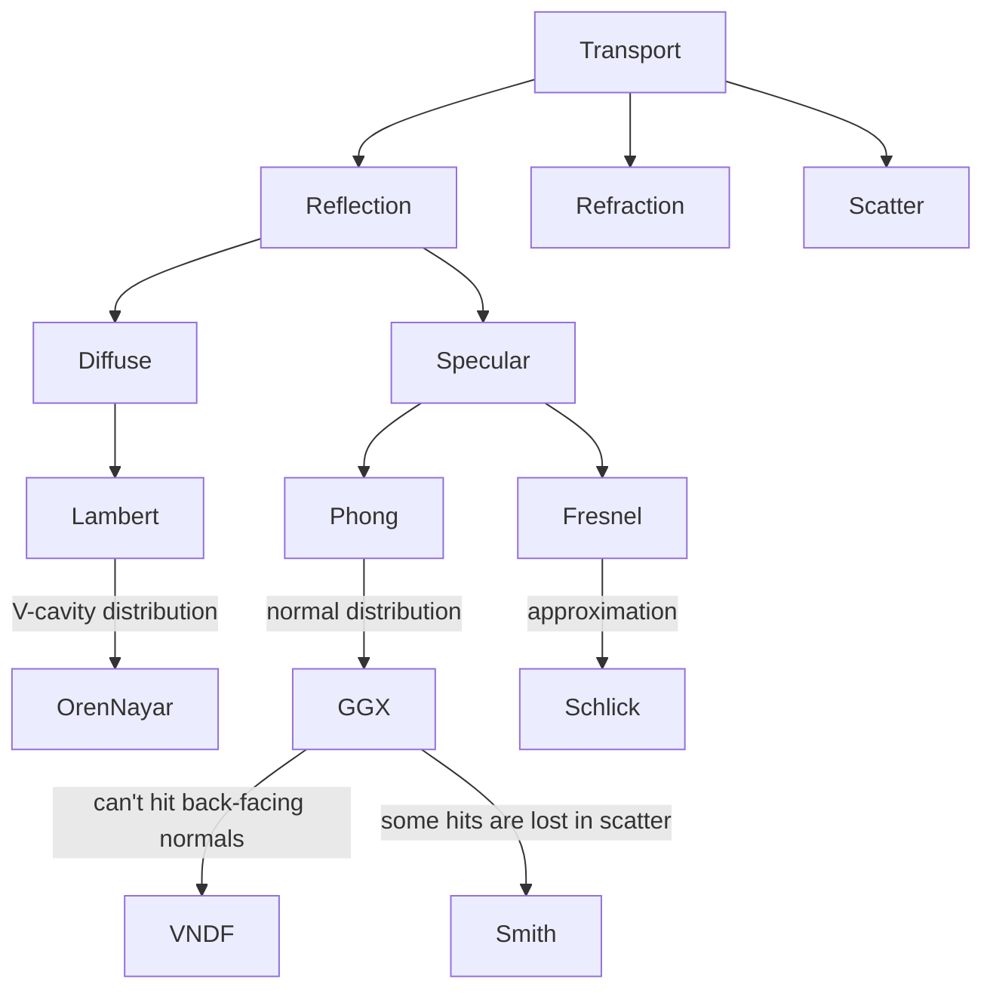

# graphics
Mind Map of Graphics

```mermaid
  graph TD;
      Transport --> Reflection;
      Transport --> Refraction;
      Transport --> Scatter;
      Reflection --> Diffuse;
      Reflection --> Specular;
      Diffuse --> Lambert;
      Specular --> Phong;
      Specular --> Fresnel;
      click Fresnel "https://www.brown.edu/research/labs/mittleman/sites/brown.edu.research.labs.mittleman/files/uploads/lecture13_0.pdf" _blank
      Fresnel --> |approximation| Schlick;
      click Schlick "http://igorsklyar.com/system/documents/papers/28/Schlick94.pdf" _blank
      Lambert --> |V-cavity distribution| OrenNayar;
      click OrenNayar "https://www1.cs.columbia.edu/CAVE/publications/pdfs/Oren_SIGGRAPH94.pdf" _blank
      Phong --> |normal distribution| GGX;
      click GGX "http://www.cs.cornell.edu/~srm/publications/EGSR07-btdf.pdf" _blank
      GGX --> |can't hit back-facing normals| VNDF;
      click VNDF "https://jcgt.org/published/0007/04/01/paper.pdf" _blank
      GGX --> |some hits are lost in scatter| Smith;
```
