# graphics

A knowledge graph of computer graphics, in which **the edges carry the reasons**.

Most maps of a field give you the nodes: a list of techniques, a reading list, a
citation graph. The nodes are the easy part — GGX, Smith, VNDF are in every
textbook index. What is almost never written down is *why one leads to the next*:

```
GGX  ──"can't hit back-facing normals"──▶  VNDF
```

That edge is the compressed judgment a practitioner accumulates and a citation
database throws away. Collecting those is the entire point of this repository.

## Reading it

Start with the [diagrams below](#foundations), or read the nodes directly —
they are plain YAML, one file per node, in [`nodes/`](nodes/):

```yaml
title: Height-Correlated Smith
cluster: materials
year: 2014
summary: >
  Accounts for the fact that a microfacet hidden from the light is likely to
  be hidden from the view as well, since both depend on the same height field.
refs:
  - title: Understanding the Masking-Shadowing Function in Microfacet-Based BRDFs
    authors: Heitz
    year: 2014
    url: https://jcgt.org/published/0003/02/03/paper.pdf
edges:
  - rel: corrects
    to: smith-masking
    why: incident and exitant masks are related, not independent
```

There are eight relations and no free-form types: `part-of`, `specializes`,
`approximates`, `corrects`, `extends`, `requires`, `alternative-to`,
`validates`. Every edge except `part-of` must say *why*. See
[SCHEMA.md](SCHEMA.md).

## Querying it

The question a rendered mind map can never answer is "what connects these two
things?" — so that is the one the tools answer:

```console
$ python3 tools/kg.py path lambert diffuse-layering
Lambertian Diffuse (lambert)
  --specializes-->
      (the simplest case, a constant BRDF)
  Diffuse Reflection (diffuse-reflection)
  --part-of-->
  Reflection (reflection)
  <--part-of--
  Fresnel Equations (fresnel)
  <--requires--
      (each microfacet is a mirror, so needs its reflectance)
  Microfacet Model (microfacet-model)
  ...
```

```console
$ python3 tools/kg.py show vndf       # a node, with incoming and outgoing edges
$ python3 tools/kg.py search fresnel  # substring across ids, titles, summaries
$ python3 tools/kg.py stats           # counts, and anything left unconnected
```

## Contributing

Add one file to `nodes/`. You never have to edit an existing node to attach a
new one, because edges are declared on the node that owns them — so two people
working in the same area do not collide.

Then run `python3 tools/build.py`, which validates the graph and regenerates
everything below this line. CI runs `--check` on every push.

An edge whose `why` could be swapped onto any other pair of nodes is not
carrying its weight. "improves on it" is not a reason; "photon count is capped
by memory, so bias never vanishes" is.

<!-- BEGIN GENERATED -->
<!-- Generated by tools/build.py from nodes/*.yaml. Do not edit by hand. -->

**161 nodes, 182 typed edges, 98 references across 12 clusters.**

Dashed boxes are nodes belonging to another cluster. Click a node to open its primary reference.

### Foundations

The quantities everything else is defined in terms of.

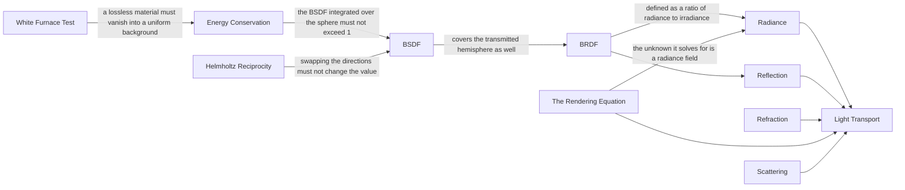

<details>
<summary>11 nodes</summary>

- [`brdf`](nodes/brdf.yaml) — **BRDF** *(1965)*. Ratio of outgoing radiance to incoming irradiance for a pair of directions. The formalism that lets a material be specified independently of the transport algorithm that uses it.
- [`rendering-equation`](nodes/rendering-equation.yaml) — **The Rendering Equation** *(1986)*. States outgoing radiance at a point as emission plus the integral of incoming radiance weighted by the BSDF. Unified the previously separate ray tracing and radiosity traditions as approximations of one integral.
- [`bsdf`](nodes/bsdf.yaml) — **BSDF**. A BRDF and a BTDF taken together, defined over the whole sphere rather than the upper hemisphere, so that one function describes both sides of a surface.
- [`energy-conservation`](nodes/energy-conservation.yaml) — **Energy Conservation**. A surface may not reflect more energy than it receives. Violating it makes multi-bounce renders diverge into brightness rather than settle.
- [`helmholtz-reciprocity`](nodes/helmholtz-reciprocity.yaml) — **Helmholtz Reciprocity**. A physically valid BSDF gives the same value when incoming and outgoing directions are swapped. Bidirectional algorithms depend on it: without it, a path built from the light differs from the same path built from the camera.
- [`light-transport`](nodes/light-transport.yaml) — **Light Transport**. The problem of computing how radiance moves through a scene from emitters to the camera, accounting for every path it can take on the way.
- [`radiance`](nodes/radiance.yaml) — **Radiance**. Power per unit projected area per unit solid angle. It is the quantity that is constant along a ray in a vacuum, which is why renderers transport it rather than irradiance or flux.
- [`reflection`](nodes/reflection.yaml) — **Reflection**. Light leaving a surface on the same side it arrived from.
- [`refraction`](nodes/refraction.yaml) — **Refraction**. Light crossing into a medium with a different index of refraction, bending by Snell's law and changing radiance by the squared IOR ratio.
- [`scattering`](nodes/scattering.yaml) — **Scattering**. Light redirected inside a medium rather than at a surface boundary.
- [`white-furnace-test`](nodes/white-furnace-test.yaml) — **White Furnace Test**. Render a material under uniform unit illumination with no absorption. A conserving, non-absorbing BSDF disappears against the background; anything visible is energy the model is losing or inventing.

</details>

### Light Transport

Algorithms that solve the rendering equation, and the estimators they are built from.

```mermaid
graph LR;
    bidirectional_path_tracing["Bidirectional Path Tracing"];
    instant_radiosity["Instant Radiosity"];
    irradiance_caching["Irradiance Caching"];
    many_light_sampling["Many-Light Sampling"];
    metropolis_light_transport["Metropolis Light Transport"];
    multiple_importance_sampling["Multiple Importance Sampling"];
    next_event_estimation["Next Event Estimation"];
    path_guiding["Path Guiding"];
    path_tracing["Path Tracing"];
    photon_mapping["Photon Mapping"];
    primary_sample_space_mlt["Primary Sample Space MLT"];
    progressive_photon_mapping["Progressive Photon Mapping"];
    radiosity["Radiosity"];
    resampled_importance_sampling["Resampled Importance Sampling"];
    restir["ReSTIR"];
    restir_gi["ReSTIR GI"];
    russian_roulette["Russian Roulette"];
    stochastic_progressive_photon_mapping["Stochastic Progressive Photon Mapping"];
    vertex_connection_and_merging["Vertex Connection and Merging"];
    whitted_ray_tracing["Whitted Ray Tracing"];
    importance_sampling["Importance Sampling"];
    monte_carlo_integration["Monte Carlo Integration"];
    rendering_equation["The Rendering Equation"];
    temporal_reprojection["Temporal Reprojection"];
    bidirectional_path_tracing -->|"also grows a subpath from the light side"| path_tracing;
    bidirectional_path_tracing -->|"the same path is built many ways and must be weighted"| multiple_importance_sampling;
    instant_radiosity -->|"collapses indirect bounces into a set of point lights"| rendering_equation;
    irradiance_caching -->|"diffuse indirect is smooth, so per-pixel sampling is wast…"| path_tracing;
    many_light_sampling -->|"cost grows linearly in the number of virtual lights"| instant_radiosity;
    many_light_sampling -->|"picks which light to sample when there are thousands"| next_event_estimation;
    metropolis_light_transport -->|"explores near paths that already found light"| bidirectional_path_tracing;
    multiple_importance_sampling -->|"light sampling alone is terrible on near-specular surfaces"| next_event_estimation;
    next_event_estimation -->|"random walks almost never hit small light sources"| path_tracing;
    path_guiding -->|"BSDF sampling ignores where the light actually is"| path_tracing;
    path_guiding -->|"the learned distribution is used as the sampling pdf"| importance_sampling;
    path_tracing -->|"expands the recursive integral into random walks"| rendering_equation;
    path_tracing -->|"the sample space is the space of light paths"| monte_carlo_integration;
    path_tracing -->|"randomizes every bounce instead of only mirrors"| whitted_ray_tracing;
    photon_mapping -->|"caustics through glass essentially never converge"| path_tracing;
    photon_mapping -->|"caches light subpaths instead of connecting to them"| bidirectional_path_tracing;
    primary_sample_space_mlt -->|"path-space mutations are hard to implement correctly"| metropolis_light_transport;
    progressive_photon_mapping -->|"photon count is capped by memory, so bias never vanishes"| photon_mapping;
    radiosity -->|"solves the diffuse-only case as a linear system"| rendering_equation;
    radiosity -->|"view-independent solve instead of per-pixel sampling"| path_tracing;
    resampled_importance_sampling -->|"approximates a pdf that cannot be sampled directly"| importance_sampling;
    restir -->|"reuses candidate pools across pixels and frames"| resampled_importance_sampling;
    restir -->|"the previous frame's reservoir must be located"| temporal_reprojection;
    restir_gi -->|"reuses indirect paths, not just direct light samples"| restir;
    russian_roulette -->|"cutting paths at a fixed depth loses energy"| path_tracing;
    stochastic_progressive_photon_mapping -->|"a fixed hit point set cannot express a pixel-wide integral"| progressive_photon_mapping;
    vertex_connection_and_merging -->|"adds photon merging as an extra connection strategy"| bidirectional_path_tracing;
    vertex_connection_and_merging -->|"connection and merging must be weighted against each other"| multiple_importance_sampling;
    whitted_ray_tracing -->|"only mirror and refraction bounces, plus one shadow ray"| rendering_equation;
    classDef ext fill:#eee,stroke:#999,stroke-dasharray:4 3,color:#555;
    class importance_sampling,monte_carlo_integration,rendering_equation,temporal_reprojection ext;
```

<details>
<summary>20 nodes</summary>

- [`whitted-ray-tracing`](nodes/whitted-ray-tracing.yaml) — **Whitted Ray Tracing** *(1980)*. Recursive ray tracing with perfect mirror reflection, refraction and a single shadow ray per light. The first algorithm to get interreflection right, and restricted to ideal specular paths.
- [`radiosity`](nodes/radiosity.yaml) — **Radiosity** *(1984)*. Discretizes the scene into patches and solves a linear system of form factors for diffuse interreflection. View-independent, so the solution can be walked through in real time, but it cannot represent specular transport.
- [`path-tracing`](nodes/path-tracing.yaml) — **Path Tracing** *(1986)*. Solves the rendering equation by tracing random walks from the camera and averaging their contributions. Unbiased and simple, and the baseline every other transport algorithm is measured against.
- [`irradiance-caching`](nodes/irradiance-caching.yaml) — **Irradiance Caching** *(1988)*. Computes diffuse indirect irradiance at sparse points and interpolates between them, adding new samples only where the gradient estimate says the interpolation would be unreliable.
- [`bidirectional-path-tracing`](nodes/bidirectional-path-tracing.yaml) — **Bidirectional Path Tracing** *(1993)*. Trace a subpath from the camera and another from a light, then connect every pair of vertices. Finds paths that neither direction would find alone, such as a room lit only through a narrow doorway.
- [`multiple-importance-sampling`](nodes/multiple-importance-sampling.yaml) — **Multiple Importance Sampling** *(1995)*. Combine several sampling strategies by weighting each sample according to the probability every strategy would have had of generating it. The balance heuristic makes the combination provably near-optimal.
- [`photon-mapping`](nodes/photon-mapping.yaml) — **Photon Mapping** *(1996)*. Trace particles from the lights, store their hits in a spatial structure, then estimate radiance at camera hit points by density estimation over nearby photons. Biased but consistent.
- [`instant-radiosity`](nodes/instant-radiosity.yaml) — **Instant Radiosity** *(1997)*. Represents indirect illumination by scattering a set of virtual point lights from the light sources, turning a bounce integral into ordinary direct lighting from many small lights.
- [`metropolis-light-transport`](nodes/metropolis-light-transport.yaml) — **Metropolis Light Transport** *(1997)*. Once a path reaching the light is found, mutate it locally and accept mutations with a Metropolis-Hastings rule, so effort concentrates where transport actually happens instead of restarting blindly.
- [`primary-sample-space-mlt`](nodes/primary-sample-space-mlt.yaml) — **Primary Sample Space MLT** *(2002)*. Runs the Metropolis chain over the random numbers fed to an ordinary path tracer rather than over path space itself, so the mutation machinery becomes independent of the underlying integrator.
- [`resampled-importance-sampling`](nodes/resampled-importance-sampling.yaml) — **Resampled Importance Sampling** *(2005)*. Draw a pool of cheap candidates, then pick one from the pool with probability proportional to a better target function. Approximates sampling from a distribution you cannot sample from directly.
- [`progressive-photon-mapping`](nodes/progressive-photon-mapping.yaml) — **Progressive Photon Mapping** *(2008)*. Keeps camera hit points instead of photons and shrinks each one's search radius as more photon passes arrive, so the estimate converges to the correct answer in bounded memory.
- [`stochastic-progressive-photon-mapping`](nodes/stochastic-progressive-photon-mapping.yaml) — **Stochastic Progressive Photon Mapping** *(2009)*. Regenerates the camera hit points every pass rather than fixing them once, which restores depth of field, motion blur and glossy reflection.
- [`vertex-connection-and-merging`](nodes/vertex-connection-and-merging.yaml) — **Vertex Connection and Merging** *(2012)*. Treats photon merging as just another sampling technique alongside bidirectional connection, and MIS-weights the two together, so one integrator handles both diffuse interreflection and caustics.
- [`path-guiding`](nodes/path-guiding.yaml) — **Path Guiding** *(2017)*. Learns an approximation of the incident radiance distribution during rendering and samples directions from it, so paths head toward light rather than being drawn from the BSDF alone.
- [`many-light-sampling`](nodes/many-light-sampling.yaml) — **Many-Light Sampling** *(2018)*. Builds a hierarchy over the light sources and descends it stochastically using bounds on each cluster's contribution, so shading cost grows with the log of the light count instead of linearly.
- [`restir`](nodes/restir.yaml) — **ReSTIR** *(2020)*. Keeps a small reservoir of chosen light samples per pixel and repeatedly resamples it against neighbours and the previous frame, so each pixel effectively inherits thousands of candidates for a handful of rays.
- [`restir-gi`](nodes/restir-gi.yaml) — **ReSTIR GI** *(2021)*. Applies reservoir resampling to indirect paths by storing sample points and their outgoing radiance, extending the technique past direct lighting.
- [`next-event-estimation`](nodes/next-event-estimation.yaml) — **Next Event Estimation**. At every path vertex, additionally sample a point on a light and trace a shadow ray to it, rather than waiting for the random walk to wander onto an emitter by chance.
- [`russian-roulette`](nodes/russian-roulette.yaml) — **Russian Roulette**. Terminate a path with some probability and divide the survivors by the survival probability. Bounds path length without the bias that a hard depth cutoff introduces.

</details>

### Materials and BSDFs

Models for what a surface does to light that hits it.

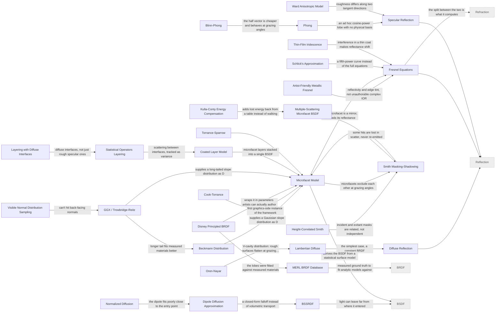

<details>
<summary>29 nodes</summary>

- [`smith-masking`](nodes/smith-masking.yaml) — **Smith Masking-Shadowing** *(1967)*. Derives the fraction of microfacets visible from a given direction from the normal distribution itself, rather than being an independent invented function. Consistency with D is what makes it the standard choice.
- [`torrance-sparrow`](nodes/torrance-sparrow.yaml) — **Torrance-Sparrow** *(1967)*. The optics paper that introduced the microfacet formulation, developed to explain off-specular peaks in measured reflectance that mirror models could not account for.
- [`phong`](nodes/phong.yaml) — **Phong** *(1975)*. An empirical specular lobe: the cosine between the reflection vector and the view, raised to a power. No physical basis, but it was the first shading model cheap enough to be ubiquitous.
- [`blinn-phong`](nodes/blinn-phong.yaml) — **Blinn-Phong** *(1977)*. Replaces Phong's reflection vector with the half vector between light and view. Cheaper, and the resulting highlight elongates at grazing angles the way real ones do.
- [`cook-torrance`](nodes/cook-torrance.yaml) — **Cook-Torrance** *(1982)*. Brought microfacet theory into graphics, with spectral Fresnel and a proper distinction between metals and dielectrics. The direct ancestor of every physically based shading model in use today.
- [`ward-anisotropic`](nodes/ward-anisotropic.yaml) — **Ward Anisotropic Model** *(1992)*. An early reflectance model with separate roughness along two tangent directions, capturing brushed metal and other surfaces whose highlight stretches along the grain.
- [`oren-nayar`](nodes/oren-nayar.yaml) — **Oren-Nayar** *(1994)*. Models a diffuse surface as a distribution of Lambertian V-cavities, which produces the flat, backscattering look of rough materials such as clay, concrete and the full moon.
- [`schlick`](nodes/schlick.yaml) — **Schlick's Approximation** *(1994)*. Approximates Fresnel reflectance as a fifth-power interpolation between normal incidence reflectance and one. Accurate enough for dielectrics and cheap enough for a pixel shader.
- [`bssrdf`](nodes/bssrdf.yaml) — **BSSRDF** *(2001)*. Relates light entering at one point to light leaving at another, rather than assuming both happen at the same place. Necessary for skin, marble and milk, where the transport distance is visible at normal viewing scale.
- [`dipole-diffusion`](nodes/dipole-diffusion.yaml) — **Dipole Diffusion Approximation** *(2001)*. Approximates subsurface transport with a pair of virtual light sources straddling the surface, reducing a volumetric simulation to a closed- form falloff.
- [`merl-database`](nodes/merl-database.yaml) — **MERL BRDF Database** *(2003)*. Densely measured reflectance for a hundred real materials. The de facto ground truth that analytic models are fitted and compared against.
- [`ggx`](nodes/ggx.yaml) — **GGX / Trowbridge-Reitz** *(2007)*. A microfacet normal distribution with a much longer tail than Beckmann. The tail is the whole point: it reproduces the soft, wide falloff around highlights that measured materials show and Beckmann clips off.
- [`layering`](nodes/layering.yaml) — **Coated Layer Model** *(2007)*. Composes a stack of smooth or rough interfaces into a single BSDF by tracking attenuation between them, giving car paint and lacquered wood without simulating the layers explicitly.
- [`microfacet-model`](nodes/microfacet-model.yaml) — **Microfacet Model** *(2007)*. Treats a rough surface as a statistical field of tiny perfect mirrors. The BSDF factors into a normal distribution D, a Fresnel term F and a masking-shadowing term G, and nearly every modern material model is an instance of it.
- [`disney-principled-brdf`](nodes/disney-principled-brdf.yaml) — **Disney Principled BRDF** *(2012)*. A single artist-facing parameter set, all normalized to zero-to-one, fitted against measured data. Its influence is mostly social: it made one vocabulary of material parameters near-universal across renderers.
- [`artist-friendly-fresnel`](nodes/artist-friendly-fresnel.yaml) — **Artist-Friendly Metallic Fresnel** *(2014)*. Reparameterizes conductor Fresnel from complex indices of refraction, which nobody can author, into reflectivity and edge tint, which can be picked from a colour swatch.
- [`correlated-smith`](nodes/correlated-smith.yaml) — **Height-Correlated Smith** *(2014)*. Accounts for the fact that a microfacet hidden from the light is likely to be hidden from the view as well, since both depend on the same height field.
- [`normalized-diffusion`](nodes/normalized-diffusion.yaml) — **Normalized Diffusion** *(2015)*. Replaces the dipole's physically derived profile with a two-exponential curve fitted directly to Monte Carlo ground truth, which matches measured skin far better near the entry point.
- [`multiple-scattering-microfacet`](nodes/multiple-scattering-microfacet.yaml) — **Multiple-Scattering Microfacet BSDF** *(2016)*. Random-walks light between microfacets instead of discarding whatever the masking term blocks. Rough metals stop going dark, which is the visible symptom of the energy single-scattering models throw away.
- [`kulla-conty`](nodes/kulla-conty.yaml) — **Kulla-Conty Energy Compensation** *(2017)*. Precomputes the directional albedo a single-scattering microfacet BRDF loses and adds a fitted lobe back to make up the difference. Far cheaper than a random walk and close enough for production.
- [`thin-film-iridescence`](nodes/thin-film-iridescence.yaml) — **Thin-Film Iridescence** *(2017)*. Models wave interference in a coating a few wavelengths thick, which makes reflectance shift with angle and produces the colours of soap films, oil slicks and anodized metal.
- [`statistical-operators-layering`](nodes/statistical-operators-layering.yaml) — **Statistical Operators Layering** *(2018)*. Represents each layer's effect as an operator on the mean and variance of a lobe, so light scattering between interfaces is carried through the stack instead of being ignored.
- [`vndf`](nodes/vndf.yaml) — **Visible Normal Distribution Sampling** *(2018)*. Samples the distribution of microfacet normals actually visible from the view direction, rather than the full distribution. Every sample is usable, and variance at high roughness drops sharply.
- [`diffuse-layering`](nodes/diffuse-layering.yaml) — **Layering with Diffuse Interfaces** *(2022)*. Extends statistical layering to stacks containing diffuse interfaces, which the lobe-variance formulation could not represent.
- [`beckmann`](nodes/beckmann.yaml) — **Beckmann Distribution**. A Gaussian distribution of microfacet slopes, derived from physical optics. Its tail falls off quickly, so highlights end more abruptly than measured materials do.
- [`diffuse-reflection`](nodes/diffuse-reflection.yaml) — **Diffuse Reflection**. Light that enters a surface, scatters under it and re-emerges in a broad distribution largely independent of the incoming direction.
- [`fresnel`](nodes/fresnel.yaml) — **Fresnel Equations**. Give the fraction of light reflected rather than transmitted at an interface, as a function of angle and the two indices of refraction. Reflectance rises to one at grazing incidence for every material.
- [`lambert`](nodes/lambert.yaml) — **Lambertian Diffuse**. A constant BRDF: outgoing radiance is the same in every direction, so the surface looks equally bright from any viewpoint. Cheap, reciprocal, and the default diffuse term almost everywhere.
- [`specular-reflection`](nodes/specular-reflection.yaml) — **Specular Reflection**. Light reflected about the surface normal, concentrated in a lobe whose width is set by how rough the interface is.

</details>

### Participating Media

Transport through a volume rather than across a surface.

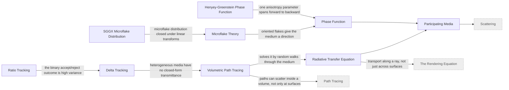

<details>
<summary>9 nodes</summary>

- [`henyey-greenstein`](nodes/henyey-greenstein.yaml) — **Henyey-Greenstein Phase Function** *(1941)*. A one-parameter phase function, originally fitted to interstellar dust, whose single anisotropy value spans strong forward through isotropic to backward scattering. Cheap to evaluate and to sample.
- [`microflake`](nodes/microflake.yaml) — **Microflake Theory** *(2010)*. Applies microfacet reasoning to volumes: the medium is filled with oriented flakes rather than isotropic particles, so anisotropic materials like cloth and fur can be rendered as media.
- [`ratio-tracking`](nodes/ratio-tracking.yaml) — **Ratio Tracking** *(2014)*. Instead of accepting or rejecting each collision outright, accumulates a continuous transmittance ratio, which removes the binary outcome that makes delta tracking noisy in optically thin media.
- [`sggx`](nodes/sggx.yaml) — **SGGX Microflake Distribution** *(2015)*. A microflake distribution parameterized by a symmetric matrix, so it stays in the same family under linear transforms and can be filtered and interpolated across levels of detail.
- [`delta-tracking`](nodes/delta-tracking.yaml) — **Delta Tracking**. Fills a heterogeneous medium with fictitious matter up to a uniform majorant so distances can be sampled analytically, then randomly rejects the fictitious collisions. Unbiased with no need to invert the optical depth.
- [`participating-media`](nodes/participating-media.yaml) — **Participating Media**. Volumes that absorb, emit and scatter light along a ray rather than only at surfaces: smoke, fog, clouds, skin interiors.
- [`phase-function`](nodes/phase-function.yaml) — **Phase Function**. The volumetric analogue of a BRDF: the angular distribution of light after a single scattering event in a medium.
- [`radiative-transfer-equation`](nodes/radiative-transfer-equation.yaml) — **Radiative Transfer Equation**. The volumetric counterpart of the rendering equation, describing how radiance changes along a ray through absorption, out-scattering, in- scattering and emission.
- [`volumetric-path-tracing`](nodes/volumetric-path-tracing.yaml) — **Volumetric Path Tracing**. Extends path tracing with sampled scattering events inside media, choosing a distance along each ray and then a new direction from the phase function.

</details>

### Sampling

Where to put the samples, and how the error is distributed when you cannot afford enough of them.

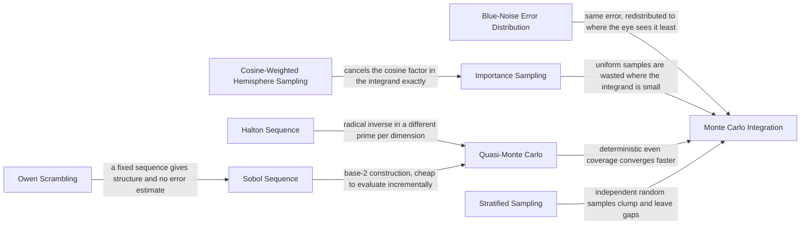

<details>
<summary>9 nodes</summary>

- [`blue-noise-sampling`](nodes/blue-noise-sampling.yaml) — **Blue-Noise Error Distribution** *(2019)*. Chooses per-pixel sample seeds so that the residual error is high- frequency across the screen. The error is not smaller, but the eye and any subsequent filter both handle it far better than white noise.
- [`cosine-weighted-hemisphere`](nodes/cosine-weighted-hemisphere.yaml) — **Cosine-Weighted Hemisphere Sampling**. Samples directions with density proportional to the cosine of the angle from the normal, cancelling the geometry term in the rendering equation exactly.
- [`halton-sequence`](nodes/halton-sequence.yaml) — **Halton Sequence**. Uses the radical inverse in a different prime base for each dimension. Simple and progressive, but correlations between high dimensions show up as visible structure.
- [`importance-sampling`](nodes/importance-sampling.yaml) — **Importance Sampling**. Draw samples proportional to how much they contribute and divide by that density. Same expected value, far less variance, and the foundation every practical estimator in rendering is built on.
- [`monte-carlo-integration`](nodes/monte-carlo-integration.yaml) — **Monte Carlo Integration**. Estimate an integral by averaging the integrand over random samples divided by their density. Converges as the inverse square root of sample count regardless of dimensionality, which is why it wins in path space.
- [`owen-scrambling`](nodes/owen-scrambling.yaml) — **Owen Scrambling**. Randomizes a low-discrepancy sequence with a recursive permutation that preserves its stratification, restoring an unbiased estimator with a measurable error rather than a fixed deterministic pattern.
- [`quasi-monte-carlo`](nodes/quasi-monte-carlo.yaml) — **Quasi-Monte Carlo**. Replaces random points with deterministic low-discrepancy sequences that cover the domain more evenly, improving the convergence rate on smooth integrands beyond the inverse square root.
- [`sobol-sequence`](nodes/sobol-sequence.yaml) — **Sobol Sequence**. A base-two low-discrepancy construction with good high-dimensional properties and very fast incremental evaluation, which is why renderers reach for it first.
- [`stratified-sampling`](nodes/stratified-sampling.yaml) — **Stratified Sampling**. Partition the domain and take one sample per cell, so samples cannot clump. Cheap, and effective in low dimensions before the number of strata explodes.

</details>

### Real-Time Shading

Getting a usable approximation of the above inside a frame budget.

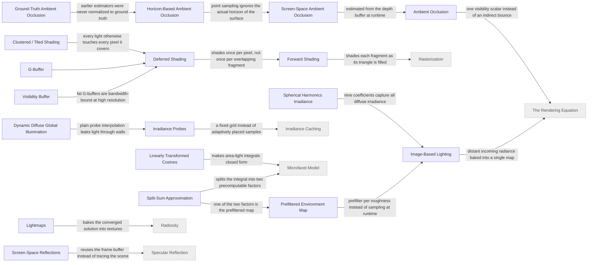

<details>
<summary>18 nodes</summary>

- [`spherical-harmonics`](nodes/spherical-harmonics.yaml) — **Spherical Harmonics Irradiance** *(2001)*. Projects distant lighting onto low-order spherical harmonics. Nine coefficients reproduce diffuse irradiance from any environment to within a percent, because the cosine lobe is itself a strong low-pass filter.
- [`ssao`](nodes/ssao.yaml) — **Screen-Space Ambient Occlusion** *(2007)*. Estimates occlusion by sampling the depth buffer around each pixel, making ambient occlusion fully dynamic and independent of scene complexity.
- [`hbao`](nodes/hbao.yaml) — **Horizon-Based Ambient Occlusion** *(2008)*. Marches the depth buffer to find the horizon angle in several directions and integrates the unoccluded wedge, which is a defensible approximation of the occlusion integral rather than a sample count.
- [`clustered-shading`](nodes/clustered-shading.yaml) — **Clustered / Tiled Shading** *(2012)*. Bins lights into screen tiles or view-space froxels so each pixel iterates only the lights that can reach it, making thousands of local lights affordable.
- [`split-sum-approximation`](nodes/split-sum-approximation.yaml) — **Split-Sum Approximation** *(2013)*. Factors the specular IBL integral into a prefiltered radiance lookup times a precomputed BRDF response table. Both halves fit in textures, which is what made physically based specular affordable in real time.
- [`visibility-buffer`](nodes/visibility-buffer.yaml) — **Visibility Buffer** *(2013)*. Stores only a triangle id per pixel and refetches attributes during shading, trading arithmetic for a dramatic reduction in the memory traffic a fat G-buffer costs.
- [`gtao`](nodes/gtao.yaml) — **Ground-Truth Ambient Occlusion** *(2016)*. Reformulates horizon-based occlusion with the correct cosine weighting and normalization so it converges to reference ambient occlusion instead of a darker look that needs artist compensation.
- [`linearly-transformed-cosines`](nodes/linearly-transformed-cosines.yaml) — **Linearly Transformed Cosines** *(2016)*. Represents a GGX lobe as a linear transform of a clamped cosine, and cosines can be integrated over a polygon in closed form. Turns area- light shading into an analytic evaluation.
- [`ddgi`](nodes/ddgi.yaml) — **Dynamic Diffuse Global Illumination** *(2019)*. Stores filtered depth alongside irradiance at each probe and weights probe contributions by a visibility test, so a probe on the far side of a wall stops contributing.
- [`ambient-occlusion`](nodes/ambient-occlusion.yaml) — **Ambient Occlusion**. A scalar factor for how much of the hemisphere above a point is blocked by nearby geometry, multiplied into ambient light. Not physically justified, but it restores the contact darkening flat ambient loses.
- [`deferred-shading`](nodes/deferred-shading.yaml) — **Deferred Shading**. Rasterize surface attributes into a G-buffer first, then light every visible pixel exactly once in a full-screen pass. Decouples lighting cost from scene complexity, at the price of bandwidth and awkward transparency.
- [`forward-shading`](nodes/forward-shading.yaml) — **Forward Shading**. Shade each fragment as its triangle is rasterized, looping over lights inside the shader. Simple and MSAA-friendly, but cost is paid again for every fragment later overdrawn.
- [`gbuffer`](nodes/gbuffer.yaml) — **G-Buffer**. The set of screen-space textures holding albedo, normal, roughness and depth between the geometry pass and the lighting pass.
- [`image-based-lighting`](nodes/image-based-lighting.yaml) — **Image-Based Lighting**. Uses a captured or rendered environment map as the light source, so that ambient light carries the colour and directionality of a real location.
- [`light-probes`](nodes/light-probes.yaml) — **Irradiance Probes**. Samples indirect irradiance at a grid of points and interpolates between them for dynamic objects, decoupling indirect lighting cost from the number of things being lit.
- [`lightmaps`](nodes/lightmaps.yaml) — **Lightmaps**. Bakes static indirect lighting into textures parameterized over surfaces. Still the highest-quality option for static geometry, at the cost of build time and unique UVs.
- [`prefiltered-environment-map`](nodes/prefiltered-environment-map.yaml) — **Prefiltered Environment Map**. Convolves the environment map against the BRDF lobe ahead of time, storing successively rougher versions in mip levels so a runtime lookup replaces a runtime integral.
- [`screen-space-reflections`](nodes/screen-space-reflections.yaml) — **Screen-Space Reflections**. Ray-marches the depth buffer to find reflected surfaces. Convincing while the reflected geometry is on screen, and falls back to an environment map the moment it is not.

</details>

### Shadows

Visibility from the light, and the artifacts of every way of caching it.

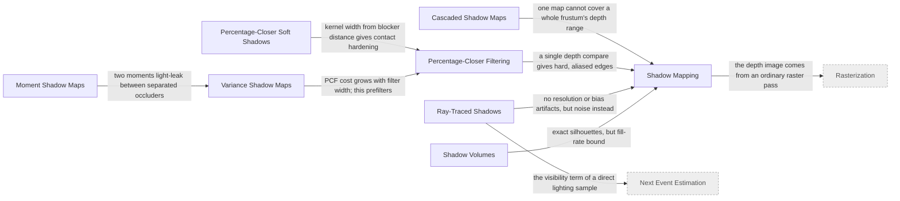

<details>
<summary>8 nodes</summary>

- [`shadow-volumes`](nodes/shadow-volumes.yaml) — **Shadow Volumes** *(1977)*. Extrudes silhouette edges away from the light and uses the stencil buffer to count entries and exits. Geometrically exact, with no resolution artifacts, but fill-rate cost scales badly.
- [`shadow-mapping`](nodes/shadow-mapping.yaml) — **Shadow Mapping** *(1978)*. Renders depth from the light's point of view, then compares each shaded point against it. Image-based, so cost is independent of geometric complexity, and every artifact it has traces back to that finite resolution.
- [`percentage-closer-filtering`](nodes/percentage-closer-filtering.yaml) — **Percentage-Closer Filtering** *(1987)*. Takes several depth comparisons across the shadow map footprint and averages the binary results. Filtering the comparisons rather than the depths is the key: averaging depths is meaningless.
- [`percentage-closer-soft-shadows`](nodes/percentage-closer-soft-shadows.yaml) — **Percentage-Closer Soft Shadows** *(2005)*. Searches for blockers first and sizes the PCF kernel by how far away they are, so shadows sharpen near contact and soften with distance.
- [`variance-shadow-maps`](nodes/variance-shadow-maps.yaml) — **Variance Shadow Maps** *(2006)*. Stores depth and squared depth so that Chebyshev's inequality bounds the occluded fraction. The map becomes linearly filterable, so it can be blurred and mipmapped like an ordinary texture.
- [`moment-shadow-maps`](nodes/moment-shadow-maps.yaml) — **Moment Shadow Maps** *(2015)*. Keeps four moments of the depth distribution rather than two, which tightens the bound enough to suppress the light leaking that two moments cannot represent.
- [`cascaded-shadow-maps`](nodes/cascaded-shadow-maps.yaml) — **Cascaded Shadow Maps**. Splits the view frustum by depth and gives each slice its own shadow map, so texel density roughly tracks screen-space size instead of being wasted on the far distance.
- [`ray-traced-shadows`](nodes/ray-traced-shadows.yaml) — **Ray-Traced Shadows**. Traces a ray toward the light per shaded point. No resolution, bias or cascade artifacts at all, replaced by sampling noise and a per-pixel tracing cost.

</details>

### Anti-Aliasing and Filtering

Reconstruction, in space and over time.

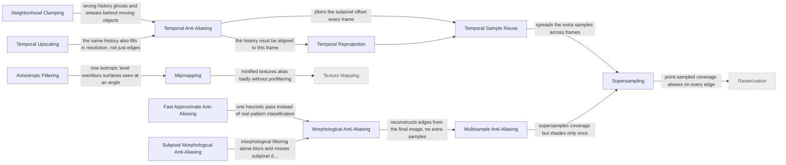

<details>
<summary>12 nodes</summary>

- [`mipmapping`](nodes/mipmapping.yaml) — **Mipmapping** *(1983)*. Stores a prefiltered pyramid and picks the level matching the screen- space footprint, turning texture minification from a sampling problem into a lookup.
- [`fxaa`](nodes/fxaa.yaml) — **Fast Approximate Anti-Aliasing** *(2009)*. A single-pass luminance-gradient filter tuned to be almost free. Blurs some genuine detail, and shipped nearly everywhere because it needs nothing from the renderer but a finished frame.
- [`mlaa`](nodes/mlaa.yaml) — **Morphological Anti-Aliasing** *(2009)*. Finds edge patterns in the finished image and reconstructs a coverage estimate from their shape, adding anti-aliasing entirely as a post- process.
- [`smaa`](nodes/smaa.yaml) — **Subpixel Morphological Anti-Aliasing** *(2012)*. Adds proper pattern classification, sharper edge detection and optional multi-sample or temporal inputs, recovering the detail that cheap morphological filters blur away.
- [`anisotropic-filtering`](nodes/anisotropic-filtering.yaml) — **Anisotropic Filtering**. Takes several mip samples along the direction the footprint is stretched, instead of choosing one level from its widest extent.
- [`antialiasing-over-time`](nodes/antialiasing-over-time.yaml) — **Temporal Sample Reuse**. The general idea that a frame is one sample of a continuously moving signal, so previous frames are usable samples if you can find the corresponding point.
- [`msaa`](nodes/msaa.yaml) — **Multisample Anti-Aliasing**. Samples coverage and depth at several points per pixel but shades only once per covered primitive, which fixes geometric edges at a fraction of the cost and does nothing for shader aliasing.
- [`neighborhood-clamping`](nodes/neighborhood-clamping.yaml) — **Neighborhood Clamping**. Constrains the reprojected history to the colour range of the current frame's neighbouring pixels, so a history sample that no longer describes this surface is pulled back into range.
- [`supersampling`](nodes/supersampling.yaml) — **Supersampling**. Render at higher resolution and downsample. Correct by construction, and linearly expensive in both shading and bandwidth, which is why everything below exists.
- [`taa`](nodes/taa.yaml) — **Temporal Anti-Aliasing**. Jitters the projection each frame and blends the reprojected history, giving supersampled quality at one sample per pixel. Now the default, and the source of most complaints about modern image softness.
- [`temporal-reprojection`](nodes/temporal-reprojection.yaml) — **Temporal Reprojection**. Uses per-pixel motion vectors to find where this pixel's surface was in the previous frame, making last frame's result available as an input to this one.
- [`temporal-upscaling`](nodes/temporal-upscaling.yaml) — **Temporal Upscaling**. Renders below display resolution and reconstructs the full frame from jittered history, treating anti-aliasing and upscaling as the same reconstruction problem.

</details>

### Denoising

Trading variance for bias so that low sample counts are shippable.


<details>
<summary>5 nodes</summary>

- [`a-trous-filter`](nodes/a-trous-filter.yaml) — **A-Trous Wavelet Filter** *(2010)*. Applies a small kernel repeatedly with exponentially increasing sample spacing, reaching a wide filter in a few passes instead of one enormous kernel.
- [`neural-denoising`](nodes/neural-denoising.yaml) — **Learned Denoising** *(2017)*. Trains a network on noisy and converged pairs, taking auxiliary buffers such as albedo and normal as input. Reconstructs detail that hand-tuned filters smooth away, and can hallucinate detail that was never sampled.
- [`svgf`](nodes/svgf.yaml) — **Spatiotemporal Variance-Guided Filtering** *(2017)*. Estimates per-pixel variance from the temporal history and drives the spatial filter width from it, so converged regions stay sharp while noisy ones are blurred hard.
- [`bilateral-filter`](nodes/bilateral-filter.yaml) — **Bilateral Filter**. Weights a blur by similarity in depth, normal and colour as well as distance, so it smooths within a surface but not across its boundaries.
- [`firefly-clamping`](nodes/firefly-clamping.yaml) — **Firefly Clamping**. Caps individual sample contributions at a threshold. Biased, unapologetically so: a single sample thousands of times brighter than its neighbours will not average out in any practical sample count.

</details>

### Geometry and Intersection

Representing surfaces and finding where a ray meets them.

```mermaid
graph LR;
    bump_mapping["Bump Mapping"];
    bvh["Bounding Volume Hierarchy"];
    catmull_clark["Catmull-Clark Subdivision"];
    displacement_mapping["Displacement Mapping"];
    dual_contouring["Dual Contouring"];
    kd_tree["kd-Tree"];
    lbvh["Linear BVH"];
    level_of_detail["Level of Detail"];
    loop_subdivision["Loop Subdivision"];
    marching_cubes["Marching Cubes"];
    meshlets["Meshlets and Mesh Shaders"];
    moller_trumbore["Moller-Trumbore Intersection"];
    normal_mapping["Normal Mapping"];
    parallax_occlusion_mapping["Parallax Occlusion Mapping"];
    polygon_mesh["Polygon Mesh"];
    rasterization["Rasterization"];
    ray_triangle_intersection["Ray-Triangle Intersection"];
    signed_distance_field["Signed Distance Field"];
    sphere_tracing["Sphere Tracing"];
    subdivision_surfaces["Subdivision Surfaces"];
    surface_area_heuristic["Surface Area Heuristic"];
    surface_representation["Surface Representation"];
    texture_mapping["Texture Mapping"];
    virtual_geometry["Virtualized Geometry"];
    watertight_ray_triangle["Watertight Ray-Triangle Intersection"];
    whitted_ray_tracing["Whitted Ray Tracing"];
    bump_mapping -->|"perturbs normals only; silhouettes stay flat"| displacement_mapping;
    bvh -->|"testing every primitive per ray is linear in scene size"| whitted_ray_tracing;
    catmull_clark -->|"bicubic B-splines extended to arbitrary quad meshes"| subdivision_surfaces;
    displacement_mapping -->|"the texture moves geometry rather than shading it"| texture_mapping;
    dual_contouring -->|"corner sign tables cannot reproduce sharp edges"| marching_cubes;
    kd_tree -->|"splits space, not objects, so nodes never overlap"| bvh;
    lbvh -->|"Morton order instead of a cost-driven split search"| surface_area_heuristic;
    level_of_detail -->|"distant meshes otherwise cost far more than they show"| rasterization;
    loop_subdivision -->|"box splines over triangles rather than quads"| subdivision_surfaces;
    marching_cubes -->|"converts the field to triangles instead of tracing it"| sphere_tracing;
    meshlets -->|"culls per cluster instead of per triangle or per object"| rasterization;
    moller_trumbore -->|"barycentric solve with nothing precomputed"| ray_triangle_intersection;
    normal_mapping -->|"stores the normal itself rather than a height"| bump_mapping;
    parallax_occlusion_mapping -->|"perturbed normals give no parallax or self-occlusion"| normal_mapping;
    polygon_mesh --> surface_representation;
    rasterization -->|"it fills projected primitives, not implicit surfaces"| polygon_mesh;
    ray_triangle_intersection -->|"the primitive being intersected"| polygon_mesh;
    signed_distance_field --> surface_representation;
    sphere_tracing -->|"the step length is the distance value itself"| signed_distance_field;
    subdivision_surfaces --> surface_representation;
    surface_area_heuristic -->|"median splits ignore the actual cost of traversal"| bvh;
    texture_mapping -->|"needs a surface parameterization to index into"| polygon_mesh;
    virtual_geometry -->|"discrete per-object LOD pops and cannot stream"| level_of_detail;
    virtual_geometry -->|"the cut through the hierarchy is expressed as clusters"| meshlets;
    watertight_ray_triangle -->|"rounding lets rays leak through shared edges"| moller_trumbore;
    classDef ext fill:#eee,stroke:#999,stroke-dasharray:4 3,color:#555;
    class whitted_ray_tracing ext;
```

<details>
<summary>25 nodes</summary>

- [`texture-mapping`](nodes/texture-mapping.yaml) — **Texture Mapping** *(1974)*. Assigns surface parameters from an image indexed by per-vertex coordinates, decoupling material detail from geometric density.
- [`bump-mapping`](nodes/bump-mapping.yaml) — **Bump Mapping** *(1978)*. Perturbs the shading normal from a height texture without moving any geometry. Almost free, and its limits are visible the moment a silhouette or a self-shadow is involved.
- [`catmull-clark`](nodes/catmull-clark.yaml) — **Catmull-Clark Subdivision** *(1978)*. Generalizes bicubic B-spline refinement to meshes of arbitrary topology. The standard modelling surface in film, and the reason quad topology is the convention it is.
- [`displacement-mapping`](nodes/displacement-mapping.yaml) — **Displacement Mapping** *(1984)*. Moves surface points along the normal by a stored height, producing detail that occludes itself and changes the silhouette because the geometry really moved.
- [`loop-subdivision`](nodes/loop-subdivision.yaml) — **Loop Subdivision** *(1987)*. The triangle counterpart of Catmull-Clark, built on box splines, for pipelines whose base meshes are triangular rather than quad.
- [`marching-cubes`](nodes/marching-cubes.yaml) — **Marching Cubes** *(1987)*. Extracts a triangle mesh from a scalar field by table lookup on the sign pattern at each cell's corners. The reason volume data can be handed to ordinary triangle pipelines.
- [`surface-area-heuristic`](nodes/surface-area-heuristic.yaml) — **Surface Area Heuristic** *(1990)*. Chooses each split by estimating traversal cost from the probability a random ray hits each child, which is proportional to its surface area. Still the quality baseline for acceleration structure builds.
- [`sphere-tracing`](nodes/sphere-tracing.yaml) — **Sphere Tracing** *(1996)*. Marches along a ray by exactly the distance value at each point, which can never overshoot the surface. Renders implicit geometry without ever tessellating it.
- [`moller-trumbore`](nodes/moller-trumbore.yaml) — **Moller-Trumbore Intersection** *(1997)*. Solves for barycentric coordinates directly with a scalar triple product, needing no precomputed plane equation and therefore no per- triangle storage.
- [`dual-contouring`](nodes/dual-contouring.yaml) — **Dual Contouring** *(2002)*. Places one vertex per cell by solving a least-squares fit to the surface normals it intersects, which lets it reproduce sharp creases that corner-sign tables average away.
- [`parallax-occlusion-mapping`](nodes/parallax-occlusion-mapping.yaml) — **Parallax Occlusion Mapping** *(2006)*. Ray-marches the height field in tangent space so texture features shift with view angle and occlude each other, recovering the parallax that normals alone cannot express.
- [`lbvh`](nodes/lbvh.yaml) — **Linear BVH** *(2012)*. Sorts primitives along a Morton curve and builds the hierarchy from the resulting bit patterns, which parallelizes perfectly and rebuilds in milliseconds at some cost in tree quality.
- [`watertight-ray-triangle`](nodes/watertight-ray-triangle.yaml) — **Watertight Ray-Triangle Intersection** *(2013)*. Reorders the arithmetic so that a ray crossing an edge shared by two triangles is guaranteed to hit exactly one of them, closing the pinhole leaks that rounding otherwise produces.
- [`virtual-geometry`](nodes/virtual-geometry.yaml) — **Virtualized Geometry** *(2021)*. Builds a hierarchy of pre-simplified clusters and chooses the cut through it per frame, so level of detail changes per cluster and streams from disk rather than switching whole objects.
- [`bvh`](nodes/bvh.yaml) — **Bounding Volume Hierarchy**. A tree of nested bounding boxes over primitives. Handles unevenly distributed geometry gracefully, refits cheaply under animation, and is what ray tracing hardware implements.
- [`kd-tree`](nodes/kd-tree.yaml) — **kd-Tree**. Recursively splits space rather than objects with axis-aligned planes. Nodes never overlap, which makes traversal tight, but primitives straddling a plane must be referenced twice.
- [`level-of-detail`](nodes/level-of-detail.yaml) — **Level of Detail**. Swaps in coarser geometry as an object shrinks on screen, keeping triangle density roughly constant in screen space.
- [`meshlets`](nodes/meshlets.yaml) — **Meshlets and Mesh Shaders**. Splits a mesh into small vertex-and-triangle clusters that can be culled and dispatched independently, replacing the fixed vertex-fetch pipeline with a programmable one.
- [`normal-mapping`](nodes/normal-mapping.yaml) — **Normal Mapping**. Stores the perturbed normal directly in a tangent-space texture instead of deriving it from height differences, which removes the derivative computation and allows normals baked from a high-resolution mesh.
- [`polygon-mesh`](nodes/polygon-mesh.yaml) — **Polygon Mesh**. Vertices, edges and faces. Explicit, cheap to rasterize and to intersect, and the representation essentially all hardware is built around.
- [`rasterization`](nodes/rasterization.yaml) — **Rasterization**. Projects primitives to the screen and fills the pixels they cover. Cost scales with primitives times coverage, and visibility comes free from a depth buffer.
- [`ray-triangle-intersection`](nodes/ray-triangle-intersection.yaml) — **Ray-Triangle Intersection**. The innermost operation of every ray tracer, so constant factors and numerical robustness here dominate both performance and correctness.
- [`signed-distance-field`](nodes/signed-distance-field.yaml) — **Signed Distance Field**. Stores distance to the nearest surface, negative inside. Booleans, offsets and blends become arithmetic on the field, and the distance value itself is a safe step length for tracing.
- [`subdivision-surfaces`](nodes/subdivision-surfaces.yaml) — **Subdivision Surfaces**. Defines a smooth limit surface as the result of infinitely refining a control mesh, giving a single representation that is both editable at low resolution and smooth at render time.
- [`surface-representation`](nodes/surface-representation.yaml) — **Surface Representation**. How a surface is stored before anything is rendered: explicitly as primitives, or implicitly as a function whose zero set is the surface.

</details>

### Color and Tone

Turning radiance into pixels a display can show.

```mermaid
graph LR;
    aces["ACES"];
    filmic_tonemapping["Filmic Tone Mapping"];
    hero_wavelength_sampling["Hero Wavelength Spectral Sampling"];
    linear_workflow["Linear Workflow"];
    reinhard_tonemapping["Reinhard Tone Mapping"];
    spectral_rendering["Spectral Rendering"];
    srgb["sRGB Transfer Function"];
    tone_mapping["Tone Mapping"];
    aces -->|"a whole managed pipeline, not just an output curve"| filmic_tonemapping;
    filmic_tonemapping -->|"an S-curve with a toe, matching film response"| reinhard_tonemapping;
    hero_wavelength_sampling -->|"one wavelength per path is unusably noisy"| spectral_rendering;
    linear_workflow -->|"inputs are encoded and must be decoded before any math"| srgb;
    reinhard_tonemapping -->|"a rational curve that never clips"| tone_mapping;
    spectral_rendering -->|"RGB math cannot express dispersion or metamerism"| linear_workflow;
    tone_mapping -->|"compressing radiance only makes sense in linear light"| linear_workflow;
```

<details>
<summary>8 nodes</summary>

- [`srgb`](nodes/srgb.yaml) — **sRGB Transfer Function** *(1996)*. The near-gamma-2.2 encoding almost all image files and displays use. It allocates more precision to darks, matching human contrast sensitivity, and is an encoding rather than a light-linear quantity.
- [`reinhard-tonemapping`](nodes/reinhard-tonemapping.yaml) — **Reinhard Tone Mapping** *(2002)*. A simple rational curve that maps zero to zero and infinity to one, so nothing ever clips. Desaturates highlights and leaves images looking flat, but it is the reference everyone starts from.
- [`filmic-tonemapping`](nodes/filmic-tonemapping.yaml) — **Filmic Tone Mapping** *(2010)*. An S-shaped curve with a toe and shoulder fitted to photographic film response, which holds saturation in the highlights where a simple ratio curve washes out.
- [`hero-wavelength-sampling`](nodes/hero-wavelength-sampling.yaml) — **Hero Wavelength Spectral Sampling** *(2014)*. Carries several correlated wavelengths per path, one chosen and the rest derived from it, which removes most of the colour noise that sampling a single wavelength per path produces.
- [`aces`](nodes/aces.yaml) — **ACES**. A standardized colour management pipeline with defined working spaces and a reference rendering transform, so that the same render matches across displays and facilities.
- [`linear-workflow`](nodes/linear-workflow.yaml) — **Linear Workflow**. Decode textures to linear light on read, do every lighting operation in linear space, and encode once on output. Blending or filtering encoded values is simply wrong arithmetic, and the errors show up as dark fringes.
- [`spectral-rendering`](nodes/spectral-rendering.yaml) — **Spectral Rendering**. Transports light at wavelengths rather than as RGB triples. Required for dispersion, fluorescence and correct metamerism under unusual illuminants, where RGB gives an answer that is simply the wrong colour.
- [`tone-mapping`](nodes/tone-mapping.yaml) — **Tone Mapping**. Maps unbounded scene radiance into the range a display can emit. Every renderer needs one, and the choice of curve is as much a look decision as a technical one.

</details>

### Neural Representations

Learned scene representations, and their reconstruction lineage.

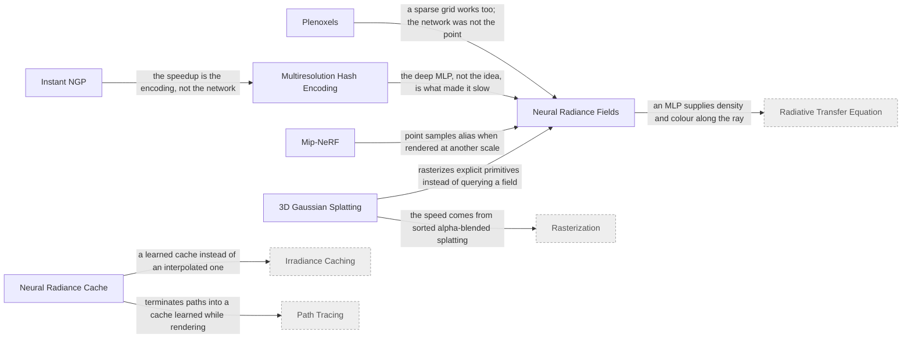

<details>
<summary>7 nodes</summary>

- [`nerf`](nodes/nerf.yaml) — **Neural Radiance Fields** *(2020)*. Fits an MLP mapping position and direction to density and colour, then renders it by volumetric ray marching. Optimizing a radiance field directly against photographs sidestepped reconstruction entirely.
- [`mip-nerf`](nodes/mip-nerf.yaml) — **Mip-NeRF** *(2021)*. Encodes conical frusta rather than points, so the representation is aware of the footprint each sample covers and stops aliasing when rendered at a different scale than it was trained on.
- [`neural-radiance-cache`](nodes/neural-radiance-cache.yaml) — **Neural Radiance Cache** *(2021)*. Trains a small network online, during rendering, to predict outgoing radiance, so paths can terminate into a learned estimate after a couple of bounces instead of continuing.
- [`instant-ngp`](nodes/instant-ngp.yaml) — **Instant NGP** *(2022)*. A fused CUDA implementation built on hash encoding that trains a usable radiance field in seconds rather than hours, which is what turned NeRF from a result into a tool.
- [`multiresolution-hash-encoding`](nodes/multiresolution-hash-encoding.yaml) — **Multiresolution Hash Encoding** *(2022)*. Replaces most of the network's capacity with trainable feature vectors in hash tables at several resolutions, so a tiny MLP suffices and collisions are resolved by the optimizer rather than avoided.
- [`plenoxels`](nodes/plenoxels.yaml) — **Plenoxels** *(2022)*. Optimizes a sparse voxel grid of spherical harmonic coefficients with no network at all, matching NeRF quality and demonstrating that the neural part was never the essential ingredient.
- [`gaussian-splatting`](nodes/gaussian-splatting.yaml) — **3D Gaussian Splatting** *(2023)*. Represents the scene as anisotropic Gaussians with spherical harmonic colour and rasterizes them sorted by depth. Explicit primitives and a rasterizer instead of ray marching an implicit field, which is what makes it real time.

</details>

<!-- END GENERATED -->
